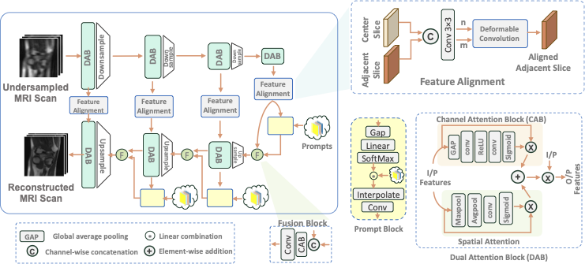
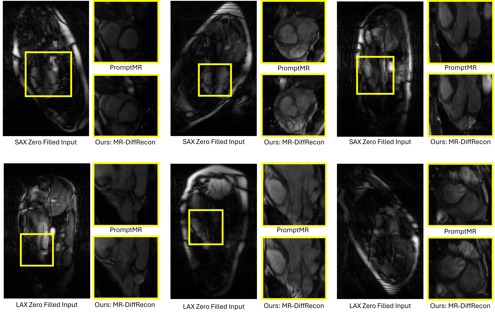
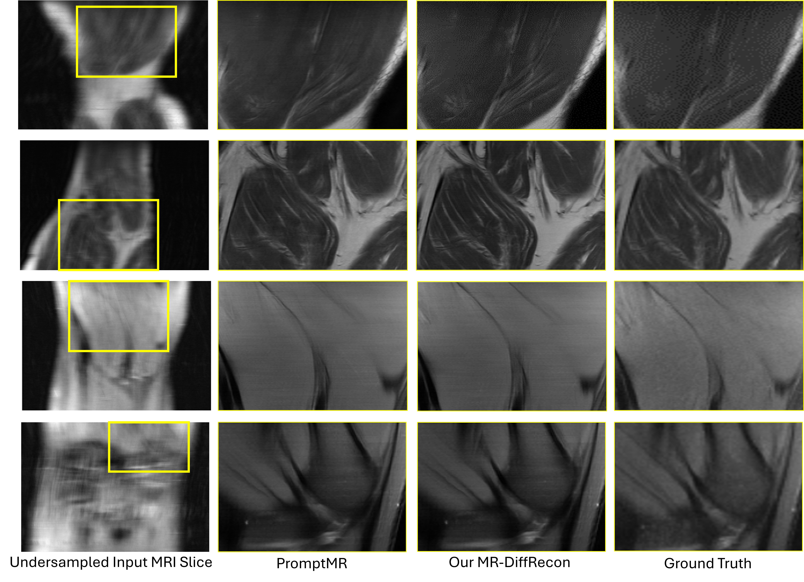

<div align="center">

# 🧠 MR-DiffRecon

### Efficient All-in-One MRI Reconstruction with Multi-Scale Alignment and Implicit Prompting

**[MIRASOL Workshop @ MICCAI 2026 — Accepted]**

[Wafa Al Ghallabi](https://scholar.google.com/citations?user=m0ez8X8AAAAJ)¹ &nbsp; · &nbsp;
Akshay Dudhane¹ &nbsp; · &nbsp;
[Salman Khan](https://salman-h-khan.github.io/)¹ &nbsp; · &nbsp;
[Fahad Shahbaz Khan](https://sites.google.com/view/fahadkhans/home)¹,²

¹ Mohamed bin Zayed University of Artificial Intelligence (MBZUAI), Abu Dhabi, UAE  
² Linköping University, Sweden

[](https://mirasol.rise-miccai.org/)
[](https://conferences.miccai.org/2026/)
[](#code-release-status)
[](https://github.com/wafaAlghallabi/MR-DiffRecon/stargazers)

</div>

---

> **TL;DR.** **MR-DiffRecon** is a resource-efficient, all-in-one accelerated MRI reconstruction framework. Within each dataset, a single model handles multiple views, contrasts, and acceleration factors. The method combines **multi-scale deformable adjacent-slice alignment**, **dual attention**, **implicit input-conditioned prompting**, and **training-time reverse diffusion refinement**. At inference, diffusion is removed entirely and only the **8-cascade unrolled backbone** is deployed.

---

## 📢 Latest Updates

- 🎉 **[2026]** MR-DiffRecon accepted to the **MIRASOL Workshop at MICCAI 2026**.
- 💻 **[In progress]** Training, testing, checkpoints, and reproducibility scripts are being prepared for public release.

---

## ✨ Key Highlights

- **All-in-one within each dataset:** one model handles multiple contrasts, views, and acceleration factors rather than maintaining a separate model for every acquisition setting.
- **Multi-scale adjacent-slice alignment:** deformable convolution aligns neighboring-slice features with the center slice at multiple encoder-decoder scales.
- **Implicit prompting:** input-conditioned prompts adapt the shared decoder to heterogeneous acquisition settings.
- **Training-time diffusion only:** reverse diffusion improves reconstruction fidelity during training but introduces **no iterative diffusion sampling at inference**.
- **Compact inference backbone:** MR-DiffRecon uses **8 cascades**, compared with 12 cascades in PromptMR.
- **Validated across two anatomies:** the same architectural design is independently evaluated on **CMRxRecon cardiac MRI** and **fastMRI knee**, using dataset-specific training.

---

## 📋 Overview

MR-DiffRecon is designed around the **accuracy-efficiency trade-off** in accelerated multi-coil MRI reconstruction. The framework combines iterative unrolling with neighboring-slice feature alignment and adaptive prompting, while using reverse diffusion only during training.

<p align="center">
  
</p>

<p align="center">
  <em>MR-DiffRecon architecture. Each cascade incorporates multi-scale feature alignment, dual-attention refinement, fusion, and implicit prompting. Reverse diffusion is used only during training; inference uses the 8-cascade reconstruction backbone alone.</em>
</p>

### Core Components

1. **Iterative Unrolling Backbone** — multi-coil reconstruction with sensitivity estimation and data consistency.
2. **Dual Attention Block (DAB)** — combines spatial and channel attention for feature refinement.
3. **Multi-Scale Feature Alignment** — aligns adjacent-slice features using deformable convolution.
4. **Fusion Block** — merges aligned neighboring information with center-slice features.
5. **Implicit Prompt Block** — provides input-adaptive conditioning for all-in-one reconstruction.
6. **Reverse Diffusion Refinement** — used only during training; removed at deployment.

---

## 📊 Main Results

### CMRxRecon — Validation Set, ×10

Results are reported as **SSIM / PSNR / NMSE (×10⁻²)**.

| Method | Cine SAX | Cine LAX | T1w | T2w |
|---|---:|---:|---:|---:|
| E2E-VarNet | 0.9744 / 42.05 / 1.6 | 0.9673 / 39.93 / 2.1 | 0.9800 / 43.12 / 1.5 | 0.9777 / 41.20 / 1.4 |
| HUMUS-Net-L | 0.9791 / 42.96 / 1.3 | 0.9689 / 40.07 / 2.0 | 0.9832 / 43.85 / 1.3 | 0.9824 / 42.39 / 1.1 |
| PromptIR | 0.9659 / 40.16 / 2.5 | 0.9581 / 38.62 / 2.7 | 0.9726 / 41.10 / 2.3 | 0.9784 / 41.10 / 1.4 |
| PromptMR | 0.9865 / 45.58 / 1.1 | 0.9836 / 43.72 / 1.2 | 0.9899 / 46.84 / 1.0 | 0.9903 / 46.24 / 0.7 |
| PromptMR+Shift | 0.9866 / 45.63 / 0.7 | 0.9837 / 43.76 / 0.9 | 0.9903 / 47.04 / 0.7 | 0.9905 / 46.33 / 0.5 |
| **MR-DiffRecon** | **0.9947 / 46.63 / 0.7** | **0.9987 / 44.94 / 0.9** | **0.9982 / 47.23 / 0.7** | **0.9982 / 47.06 / 0.5** |

### fastMRI Knee Multi-Coil — Test Set, ×8

| Method | SSIM ↑ | PSNR ↑ | NMSE (×10⁻²) ↓ |
|---|---:|---:|---:|
| E2E-VarNet | 0.8936 ± 0.1157 | 37.30 ± 4.925 | 0.8690 ± 0.9279 |
| HUMUS-Net | 0.8946 ± 0.1162 | 37.20 ± 5.009 | 0.8974 ± 0.9743 |
| HUMUS-Net-L | 0.8955 ± 0.1161 | 37.45 ± 5.067 | 0.8587 ± 0.9930 |
| PromptMR | 0.8970 ± 0.1168 | 37.63 ± 5.319 | 0.8344 ± 0.9648 |
| **MR-DiffRecon** | **0.9111 ± 0.1152** | **37.95 ± 5.193** | **0.8247 ± 0.9447** |

### Inference Efficiency

Accuracy values below correspond to CMRxRecon Cine SAX at ×10.

| Method | Params (M) ↓ | FLOPs (G) ↓ | SSIM ↑ | PSNR ↑ |
|---|---:|---:|---:|---:|
| E2E-VarNet | 93.08 | 370.14 | 0.9744 | 42.05 |
| HUMUS-Net-L | 160.97 | 575.16 | 0.9791 | 42.96 |
| PromptIR | 284.74 | 4455.11 | 0.9659 | 40.16 |
| PromptMR | 69.71 | 1784.75 | 0.9865 | 45.58 |
| **MR-DiffRecon** | **53.33** | **1647.04** | **0.9947** | **46.63** |

Compared with PromptMR, MR-DiffRecon uses **23.49% fewer parameters** and **7.7% fewer GFLOPs**, while improving SSIM and PSNR in this comparison.

---

## 🖼 Qualitative Results

### CMRxRecon Cardiac MRI — ×10

<p align="center">
  
</p>

<p align="center">
  <em>Representative CMRxRecon examples comparing zero-filled input, PromptMR, and MR-DiffRecon.</em>
</p>

### fastMRI Knee — ×8

<p align="center">
  
</p>

<p align="center">
  <em>Representative fastMRI knee examples comparing undersampled input, PromptMR, MR-DiffRecon, and ground truth.</em>
</p>

---

## 🗂 Datasets

Experiments use two public multi-coil MRI datasets:

| Dataset | Anatomy | Acquisition settings used in this work |
|---|---|---|
| **CMRxRecon** | Cardiac MRI | Cine SAX/LAX, T1w/T2w mapping; ×4, ×8, ×10 training settings; reported at ×10 |
| **fastMRI** | Knee MRI | Multi-coil knee; ×4 and ×8 training settings; reported at ×8 |

Dataset preparation and splits follow the protocol described in the paper and PromptMR. Source MRI data are **not redistributed** in this repository; users should obtain the datasets from their official providers and comply with the corresponding licenses and terms of use.

---

## ⚙️ Installation

The full environment specification will be released together with the training and evaluation code.

```bash
# Clone the repository
git clone https://github.com/wafaAlghallabi/MR-DiffRecon.git
cd MR-DiffRecon
```

A `requirements.txt` / environment file and complete setup instructions will be added with the code release.

---

## 🚀 Training and Evaluation

Training and testing scripts are currently being prepared for release. The repository will include commands for:

```text
training/       # CMRxRecon and fastMRI training entry points
evaluation/     # Reconstruction and metric evaluation
configs/        # Dataset/model configuration files
checkpoints/    # Download instructions for released model weights
```

### Expected evaluation outputs

The evaluation pipeline will report:

- SSIM
- PSNR
- NMSE
- Parameter count
- Per-slice FLOPs

Please watch this repository for the full reproducibility release.

---

## 🔧 Code Release Status

| Component | Status |
|---|:---:|
| README and method/results documentation | ✅ Available |
| Architecture and qualitative figures | ✅ Available |
| Training scripts | 🚧 In progress |
| Testing / evaluation scripts | 🚧 In progress |
| Configuration files | 🚧 In progress |
| Pretrained checkpoints | 🚧 In progress |

---

## 📝 Citation

If you find MR-DiffRecon useful in your research, please cite:

```bibtex
@inproceedings{alghallabi2026mrdiffrecon,
  title     = {MR-DiffRecon: Efficient All-in-One MRI Reconstruction with Multi-Scale Alignment and Implicit Prompting},
  author    = {Al Ghallabi, Wafa and Dudhane, Akshay and Khan, Salman and Khan, Fahad Shahbaz},
  booktitle = {MIRASOL Workshop at MICCAI},
  year      = {2026}
}
```

The citation will be updated with the final proceedings information when available.

---

## 📬 Contact

For questions related to the repository or paper, please open a GitHub issue.

---

## 🙏 Acknowledgements

This work was conducted at the **Mohamed bin Zayed University of Artificial Intelligence (MBZUAI)**. We thank the developers and maintainers of CMRxRecon, fastMRI, and the open-source MRI reconstruction methods used for comparison.
